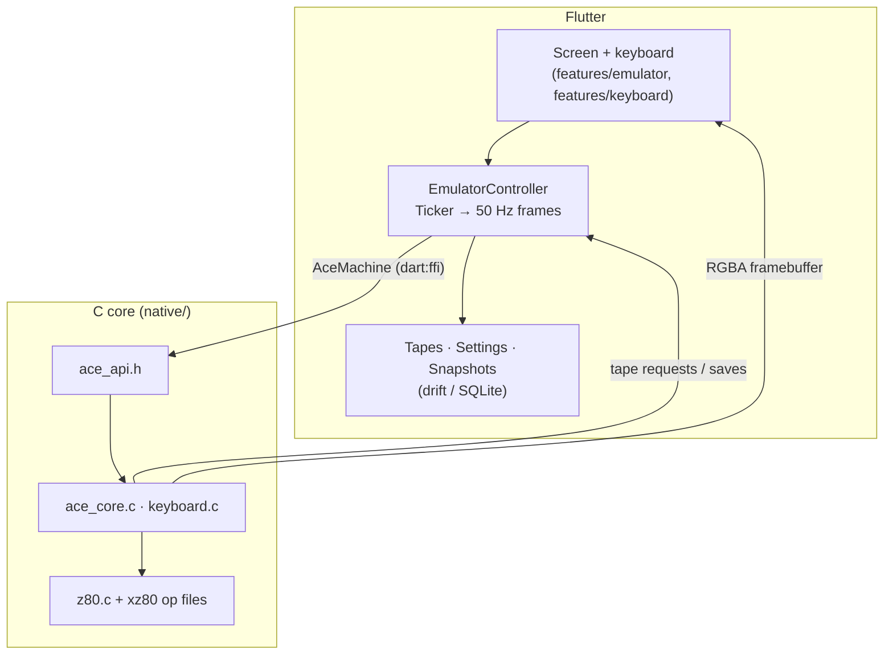

# iACE2

A **Jupiter ACE** emulator for iPad and Android tablets, bundled with the original user manual. It is a Flutter rebuild of [iACE](https://github.com/epatel/iACE) (iOS, 2012), and the iOS build ships as version 2 of the same App Store app.

The Jupiter ACE (1982) was the odd one out among the home micros of the 80s. It ran **FORTH** instead of BASIC. Steven Vickers and Richard Altwasser designed it after working on the ZX81 and ZX Spectrum at Sinclair.

> "Jupiter ACE" is a trademark of Andrews UK Ltd.

## Status

Everything from iACE 1.x works on iOS and Android: the emulator, keyboard, sound, the manual with runnable examples, the drawer UI, and saved tapes and sessions. There is also a tape browser with `.TAP` import and export. What remains is store work: signing, screenshots and publishing the source (see [store/listing.md](store/listing.md)). [project-plan.md](project-plan.md) lists every phase and its state.

| | |
|---|---|
| ✅ | Z80 core in C, frame-stepped at 50 Hz (3.25 MHz) |
| ✅ | Dart ↔ C through `dart:ffi` with native-assets build hooks (iOS, Android, host) |
| ✅ | Live screen with pixel-perfect scaling, and the photo keyboard with multi-touch and sticky shift |
| ✅ | `SAVE` / `LOAD` to a SQLite database, a session that survives restarts, and import from iACE 1.2 |
| ✅ | Beeper sound through miniaudio (CoreAudio / AAudio / OpenSL) |
| ✅ | The user manual (PDF) with tappable "Enter" examples that type into the ACE, and links |
| ✅ | The iACE drawer UI: screen and keyboard slide down over the manual, with settings under the keyboard's lid |
| ✅ | Tape browser: LOAD, delete, `.TAP` import/export (share sheet / file picker) |
| ✅ | About dialog with licences, screen-reader text for the ACE screen, release builds |
| ⏳ | Store release: signing, screenshots, public source URL (see `store/listing.md`) |

## Getting started

Requirements: Flutter 3.47+ (Dart 3.13), Xcode for iOS, the Android SDK for Android, and a C compiler for the host tests (Xcode's clang works).

```sh
make setup        # packages + toolchain check
make test         # C core tests + Flutter tests
make run-ios      # or: make run-android DEVICE=<id>   (see `flutter devices`)
```

`make help` lists every target:

| Target | What it does |
|---|---|
| `setup` | `flutter pub get`, `flutter doctor`, `pod install` |
| `test` | `core-test` + `flutter-test` |
| `core-test` / `core-test-ubsan` | Build and run the C tests on the host (optionally with UBSan) |
| `integration-test DEVICE=<id>` | Run the core on a real device or simulator |
| `analyze` / `format` | `flutter analyze`; `dart format` + `clang-format` |
| `gen` / `ffigen` / `drift` | Regenerate the FFI bindings and database code |
| `db-schema-dump` / `db-migration-test` | Snapshot the database schema; run the schema/migration tests |
| `assets` | Re-extract assets from the original iACE (keyboard map, Frogger tape, …) |
| `build-ios` / `build-android` | Release `.ipa` / `.aab` |

## How it fits together



- **`native/`** is the machine in portable C: memory map, ROM tape patches, keyboard matrix, the "type from the manual" spooler, video, versioned snapshots and beeper events. It has no globals and no platform code.
- **`lib/core/ffi/`** holds the generated bindings and `AceMachine`, the only Dart class that touches FFI types.
- **`lib/core/db/`** is the drift database. Every schema version is committed in `drift_schemas/` and checked by tests.
- **`lib/features/`** is organised by feature: `emulator`, `keyboard`, `manual`, `tapes`, `settings`, `legacy`, `shell`.
- **`tool/`** has the converters that extracted the assets from the original app. To run them again (`make assets`), clone [epatel/iACE](https://github.com/epatel/iACE) into `archive/iACE`; that folder is not tracked.
- **`cards/`** has short reference notes for each area (emulator internals, FFI, persistence, keyboard, manual). [CLAUDE.md](CLAUDE.md) says when to read which.

## Persistence and upgrades

Every stored format has a version and an upgrade path:

- **SQLite schema:** migrations are generated step by step (`make db-schema-dump`) and tested against every committed schema version.
- **Machine snapshots:** the `ACE2SNAP` binary has a version header, and the C loader keeps a reader for each older version. If a snapshot is unreadable, the machine cold-boots.
- **iACE 1.2 data (iOS):** on first launch, old `SAVE`d tapes and preferences are imported once. They never overwrite anything newer.

See [cards/persistence-migrations.md](cards/persistence-migrations.md).

## Credits and license

- Z80 emulation: **xz80** by Ian Collier (1994).
- PDF rendering: [pdfrx](https://pub.dev/packages/pdfrx) (PDFium).
- Audio output: [miniaudio](https://miniaud.io) by David Reid (public domain / MIT-0).
- The Jupiter ACE emulator this grew from: xAce by Edward Patel (1999), improved by [Lawrence Woodman](https://github.com/LawrenceWoodman/xAce).
- The manual scan comes from [jupiter-ace.co.uk](http://www.jupiter-ace.co.uk). Frogger is by T. Skinner.

The code is licensed under the **GNU General Public License v2 or later** (see [LICENSE](LICENSE)), following the xz80 and xAce sources it builds on. The app's About dialog lists every licence.
