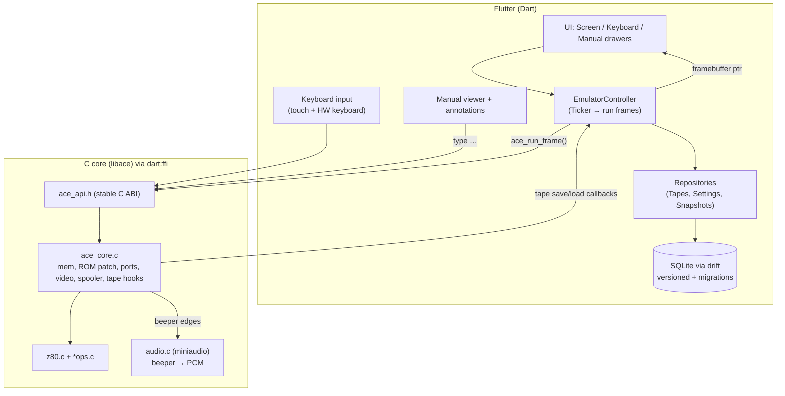

# iACE2 — Project Plan

Rebuild **iACE** (the Jupiter ACE emulator with its bundled user manual, in `archive/iACE`) as a Flutter app for **iOS and Android tablets**. The Z80 emulation stays in C and is called from Dart through `dart:ffi`.

Status: **approved 2026-09-24.** The decisions are recorded in §9.

---

## 1. What the original app does

The original is about 5.7k lines of Objective‑C and C, portrait iPad only, with a fixed 768×1024 layout.

| Area | Original implementation | Notes for the port |
|---|---|---|
| Z80 CPU | `z80.c`, `z80ops.c`, `cbops.c`, `edops.c` (xz80, Ian Collier, GPL) | Keep as C. `mainloop()` is an endless `while(1)` loop and needs to become "run one frame". |
| Machine glue | `iace.m`: 64K `mem[]`, ROM load and patch (`ED FC` → `load_p`, `ED FD` → `save_p`), memory mirroring in the `store` macro, port `0xFE` I/O, 50 Hz pacing with `sleep`, screen render | Rewrite as pure C `ace_core.c`, with no ObjC or Foundation. |
| Keyboard matrix | `keyboard_ports[8]` plus the `keypress_response` table, which live in `ViewController.m` | Move into C. Dart only sends "key down/up (port, mask)" or "ACE char". |
| Spooler ("type" links) | Feeds one char at a time from the manual into the keyboard during `in(0xFEFE)` scans | Move into C. It is exposed as `ace_spool(const char*)`. |
| Video | 32×24 char cells, charset at `0x2C00`, video RAM at `0x2400`, inverse bit 7, rendered to a 256×192 RGBA buffer, redrawn only when changed, refreshed at 20 Hz | C renders into a shared RGBA buffer. Dart turns it into a `ui.Image` and draws it with nearest-neighbour scaling. |
| Sound | Beeper edges on `out(0xFE)` → period → sine wave through an AudioUnit | The C core records edge timestamps per frame, and **miniaudio** plays a square/filtered wave natively. |
| Tapes | `save_p`/`load_p` store `name.dic` / `name.byt` blobs in `Documents/tapes.dic`. Frogger is seeded. When a file is missing, a "Couldn't load your file!" stub is loaded | Tapes go in the database. The core calls Dart-supplied callbacks, or uses a C-side buffer that Dart fills. |
| Snapshot | Raw `memcpy` of the Z80 `g` struct plus 64K memory, saved to `Caches/state.mem` when the app goes to the background and restored on launch | Use a **versioned** snapshot format (see §5). |
| Manual | `JA-Manual-Second-Edition.pdf` in a custom two-page paging scroll view with a page slider. The last page is remembered | Use the `pdfrx` viewer (PDFium) with an annotation overlay. |
| Annotations | `annotations.dic` (an NSKeyedArchiver of `{page: [ {rect, value} ]}`). Values are `goto N`, `open URL`, `type TEXT` (where `\` means newline). There is a hidden edit mode for authoring them | Convert once to `assets/annotations.json` with page-relative coordinates. Keep the edit mode behind a debug flag. |
| UI chrome | A screen drawer and a keyboard drawer slide down over the manual, using drag and tap gestures. A "settings lid" under the keyboard hides Reset, the sticky-shift toggle and info links | Rebuild in Flutter with `Stack` and drag/animation controllers, laid out responsively rather than with fixed pixels. |
| Keyboard UI | `jupiterace.jpg` with about 40 invisible buttons. Each tag is `(mask << 8) \| port` | Extract the button rects and tags from `ViewController.xib` into `assets/keyboard_map.json` and use them as hit regions over the photo. |

## 2. Architecture



### 2.1 C core API (sketch)

The implemented API is `native/include/ace_api.h` (Phase 1). It differs from this sketch in the tape calls, which are `ace_tape_request` / `ace_tape_supply` / `ace_tape_saved`, and it adds `ace_beeper_events`. The audio calls come in Phase 6.

```c
// native/include/ace_api.h — the only header ffigen sees
typedef struct ace_machine ace_machine;          // opaque; no globals exposed

ace_machine* ace_create(const uint8_t* rom, size_t rom_len);
void     ace_destroy(ace_machine*);
void     ace_reset(ace_machine*);
int      ace_run_frame(ace_machine*);            // one 20 ms / 65000 T-state frame; returns flags (screen dirty, tape req…)
const uint8_t* ace_framebuffer(ace_machine*);    // 256*192*4 RGBA, stable pointer
void     ace_key(ace_machine*, int port, int mask, int down);
void     ace_key_char(ace_machine*, int ace_char, int down);   // uses keypress_response table
void     ace_spool(ace_machine*, const char* text);  void ace_spool_cancel(ace_machine*);
// tape: core pauses at ED FC/FD and reports a request; Dart answers
int      ace_tape_pending(ace_machine*, ace_tape_req* out);
void     ace_tape_supply(ace_machine*, const uint8_t* data, size_t len); // or len=0 → "missing" stub
// snapshots: explicit versioned serialisation, never raw struct memcpy
size_t   ace_snapshot_size(void);
size_t   ace_snapshot_save(ace_machine*, uint8_t* out, size_t cap);
int      ace_snapshot_load(ace_machine*, const uint8_t* in, size_t len); // handles older versions
// audio
int      ace_audio_start(ace_machine*); void ace_audio_stop(ace_machine*); void ace_audio_set_volume(ace_machine*, float);
```

Key refactors inside the C code:
- **Frame-stepped CPU.** `mainloop()` becomes `z80_run(machine, tstate_budget)`. The 50 Hz sleep in `fix_tstates()` goes away, and Dart drives timing with a `Ticker` and a frame accumulator. At 65000 T-states a frame is far below 1 ms, so it can run on the UI isolate. If profiling shows jank, the fallback is a helper isolate, which can share the native framebuffer pointer.
- **No globals.** The `g` register struct, `mem`, `tstates` and similar move into `ace_machine`. The `fetch`/`store` macros take the machine pointer, or use a single static instance behind the API as a first step.
- **Snapshot serialisation.** Registers are written field by field in a fixed byte order. This replaces the original's copy of a C struct, whose layout could change with the compiler.
- `ace.rom` is loaded by Dart from assets and passed to `ace_create`, instead of the generated `ace.rom.h`. Frogger becomes an asset (`assets/tapes/frogger.dic`), extracted from `frogger.h`.

### 2.2 Building the native code

- Use **Flutter native-assets build hooks** (`hook/build.dart` + `package:native_toolchain_c`) to compile `native/src/*.c` for iOS (device and simulator), Android (all ABIs) and the host (macOS, for tests). If hooks cause trouble on either platform, fall back to the `flutter create --template=plugin_ffi` layout (CMake for Android, podspec for iOS).
- Generate Dart bindings from `ace_api.h` with **`package:ffigen`** (`make ffigen`).
- `miniaudio.h` (single header, MIT-0/public domain) is vendored in `native/third_party/`. It uses CoreAudio on iOS and AAudio/OpenSL on Android.
- Because the host build exists, `flutter test` can load the real core. Integration tests boot the ROM without a device.

## 3. Flutter app structure (feature-first)

```
lib/
  main.dart, app.dart
  core/ffi/           # generated bindings + thin AceMachine Dart wrapper (Finalizer → ace_destroy)
  core/db/            # drift database, tables, migrations/, schema versions
  features/
    emulator/         # EmulatorController, ScreenView (CustomPainter, FilterQuality.none), lifecycle → snapshot
    keyboard/         # AceKeyboard (photo + hit regions), sticky-shift, HardwareKeyboard mapping
    manual/           # ManualView (pdfrx), AnnotationLayer, annotation actions, edit mode (debug)
    tapes/            # TapeRepository, tape browser (list/rename/delete/import/export/share)
    settings/         # settings lid: reset, sticky shift, volume, links
    shell/            # drawer layout: screen + keyboard drawers over the manual; portrait/landscape
native/
  include/ace_api.h
  src/ace_core.c z80.c z80ops.c cbops.c edops.c audio.c keyboard.c
  third_party/miniaudio.h
  test/               # C unit tests (host), e.g. boot + "2 2 + ." → "4 OK", zexdoc (optional)
hook/build.dart
assets/ ace.rom, manual.pdf, annotations.json, keyboard_map.json, tapes/frogger.dic, images/
tool/                 # one-shot converters: annotations.dic → json, xib → keyboard_map.json, frogger.h → .dic
```

State management uses plain `ChangeNotifier`/`ValueNotifier` plus `provider` (decided).

### Tablet UX
- **Portrait only**, as in the original: screen and keyboard drawers slide down over the manual. Landscape is out of scope (decided).
- Tablet-only: iOS sets `UIDeviceFamily = [2]` (iPad). Android declares `<supports-screens>` large/xlarge and `requiresSmallestWidthDp≥600` on the Play listing.
- Hardware keyboard support is deferred past v1. When added, it maps through the same char table as the spooler.
- Screen scaling uses integer or pixel-perfect nearest-neighbour. An optional "CRT" look can come later.

## 4. Persistence and migrations

All persisted data has an explicit version and a tested upgrade path.

### 4.1 Database: SQLite with **drift**

| Table | Columns | Purpose |
|---|---|---|
| `tapes` | id, name, kind (`dic`/`byt`), data BLOB, created_at, updated_at, source (`seed`/`user`/`import`/`legacy`) | Replaces `tapes.dic` |
| `settings` | key TEXT PK, value TEXT | lastpage, sticky_shift, reveal_hint_shown, volume, … (replaces NSUserDefaults) |
| `snapshots` | id, slot, format_version, data BLOB, created_at | Auto-save slot 0, plus optional user slots later |
| `user_annotations` *(later)* | id, page, rect, value | Only if user-created bookmarks/notes are added |

Migration rules, which will also go into `CLAUDE.md` as a standing default:
- `schemaVersion` starts at **1**. Every change bumps it and adds a step in `onUpgrade` using drift's `stepByStep` generated migrations.
- Each version's schema is committed with `make db-schema-dump` (`drift_dev schema dump` → `drift_schemas/`). Generated migration tests (`drift_dev schema generate`) check every `vN → vLatest` path. `make test` runs them.
- Existing migration steps are never edited.
- Seed data (Frogger) goes in `onCreate` and is idempotent.

### 4.2 Snapshot binary format
The format is `"ACE2SNAP"` magic, `u16 format_version`, then fields in little-endian order: registers, then 64K RAM, then keyboard/spooler state. `ace_snapshot_load` accepts every older version and upgrades it in C, and C unit tests cover each version. If a snapshot is unknown or corrupt, the machine falls back to a cold boot and never crashes.

### 4.3 Legacy import (iOS, in v1)
The new app ships as an update to the App Store app (id590389822): iOS bundle ID **`com.memention.iACE`**, team `67Y4XH38L7`, version **2.0.0** (the old app was 1.2). Android uses `com.memention.iace`. On first launch, a one-time step
imports `Documents/tapes.dic` (a binary plist of name → bytes) into `tapes` with `source=legacy`, and imports `lastpage` / `toggle_shift_keys` from the old NSUserDefaults. The old `state.mem` is dropped because its raw-struct layout isn't portable. A `settings` flag records that the import ran.

### 4.4 Tape exchange
v1 supports **`.TAP`** (the format used by other ACE emulators, e.g. EightyOne): import through the file picker and export through the share sheet. A `.TAP` holds header+data block pairs, which map onto `tapes` rows. Raw `.dic`/`.byt` import/export is deferred.

## 5. Makefile (management)

The root `Makefile` wraps everything, so agents and humans use the same entry points:

| Target | Does |
|---|---|
| `make setup` | `flutter pub get`, check the toolchain (`flutter doctor`), `pod install` |
| `make gen` | `ffigen` plus `build_runner` (drift) |
| `make ffigen` / `make drift` | Run the individual generators |
| `make core` / `make core-test` | Build the C core for the host and run the C unit tests (boot, keyboard, tape, snapshot versions) |
| `make test` | `core-test` plus `flutter test` (unit, widget, drift migration tests) |
| `make analyze` / `make format` | `flutter analyze`, `dart format`, `clang-format` on the C code (excluding vendored code) |
| `make run-ios` / `make run-android` | Run on an iPad or Android tablet device or emulator |
| `make build-ios` / `make build-android` | `flutter build ipa` / `flutter build appbundle` |
| `make assets` | Run `tool/` converters (annotations, keyboard map, frogger) |
| `make db-schema-dump` / `make db-migration-test` | drift schema snapshot and generated migration tests |
| `make clean` | Flutter clean plus native build dirs |
| `make help` | Print the targets (the default target) |

## 6. Agentic setup (per ai.memention.net/setup)

These are recommendations, pending your confirmation:

| Pattern | Use? | Why |
|---|---|---|
| **Shared Project Plan** | ✅ | This file (`project-plan.md`) is the shared objective for subagents |
| **Standing Defaults** | ✅ | The project has persistent data, so a migrations card is required, along with "use `make` targets" |
| **Context Cards** | ✅ | `cards/`: `emulator-core.md` (memory map, ROM patches, ports, T-state timing), `ffi-bridge.md`, `persistence-migrations.md`, `manual-annotations.md`, `keyboard-matrix.md` |
| **Feature-First Architecture** | ✅ (light) | `lib/features/*` as above |
| Feature-First Advanced / Two-Tier CLAUDE.md | ❌ | Too few interacting features to need them |
| **Agent Skills** | Maybe | e.g. a `verify-emulator` skill: boot, type, compare the screen |

`CLAUDE.md` uses trigger phrases, for example "when touching `native/` → read cards/emulator-core.md" and "when changing the DB → read cards/persistence-migrations.md".

## 7. Phases and milestones

Each phase ends with a check that can be verified.

| # | Phase | Deliverables | Done when |
|---|---|---|---|
| 0 ✅ | **Scaffold** | `flutter create` (iOS + Android, `com.memention`), Makefile, CLAUDE.md + cards, `git init`, analysis_options, CI-ready `make test` | `make setup && make test` is green on an empty app |
| 1 ✅ | **C core extraction** | `ace_core.c` + refactored Z80 (frame-stepped, no ObjC, no globals), `ace_api.h`, host build, C tests | Headless test: boot ROM 100 frames; spool `2 2 + .\n` → screen contains `4  OK`. Also: every key, SAVE/LOAD round trip, missing and malformed tapes, Frogger, snapshots, beeper (62 checks, UBSan clean) |
| 2 ✅ | **FFI bridge** | build hook, ffigen bindings, `AceMachine` wrapper, `flutter test` loading the host lib | The same boot test passes from Dart: 10 host tests, plus an integration test on the iPad simulator and an Android emulator |
| 3 ✅ | **Screen and loop** | `EmulatorController` (Ticker, 50 Hz accumulator, pause on background), `ScreenView`, in-memory `TapeLibrary` seeded with Frogger | The app shows the live ACE prompt on an iPad sim and Android tablet emulator. Verified on the iPad Pro 13" simulator and a Pixel Tablet API 35 emulator by typing through the VM service; Frogger runs |
| 4 | **Keyboard** | `tool/` xib → `keyboard_map.json`, photo keyboard with hit regions, sticky shift | You can type FORTH on screen; the key matrix is tested per key |
| 5 | **Persistence** | drift DB v1 + schema dump + migration tests, settings, tapes (SAVE/LOAD via ED FC/FD), Frogger seed, snapshot auto-save/restore | `SAVE`/`LOAD` round-trip; `LOAD frogger` plays; kill and relaunch restores the session |
| 6 | **Audio** | beeper edge log + miniaudio output, volume setting, audio-session handling (interruptions, silent switch policy) | `BEEP` in FORTH is audible on both platforms with no clicks or pops |
| 7 | **Manual** | pdfrx viewer, page slider, remember page, `annotations.json` overlay with `goto`/`open`/`type` actions, debug edit mode | Tapping a "type" example in the manual runs it in the emulator |
| 8 | **Shell and UX** | drawers with drag and snap, settings lid (reset confirm, sticky shift, links), icons and splash, portrait lock | Matches original behaviour |
| 9 | **Polish and release** | tape browser with `.TAP` import/export, legacy import from iACE 1.2, accessibility pass, performance profiling, store metadata, GPL notices and source link | Release builds from `make build-ios` / `make build-android` installed on real tablets |

Phases 1–2 carry the most risk and should be done first. Phases 4, 6 and 7 are independent after Phase 3 and can run as parallel subagent tasks.

## 8. Risks and notes

- **Licensing:** the Z80 core and glue are GPL v2+, so the app stays GPL and the source must be published. The Jupiter ACE ROM and the manual scan were bundled in the original App Store app; check whether redistribution rights still hold now that the "Jupiter ACE" trademark belongs to Andrews UK Ltd. That affects naming and the store listing.
- **Tape hook re-entrancy:** the original `load_p`/`save_p` use static "first time" state across two consecutive calls (header block, then data block). Keep that two-block protocol explicit in the C state machine.
- **Timing:** the original paced frames with `sleep`. Under a Ticker, frames must be caught up without spiralling (cap at about 3 frames per tick). Audio timing comes from T-states, not wall-clock time.
- **Audio latency / Android:** miniaudio + AAudio is fine. The original's sine synthesis is replaced by a band-limited square wave, which is closer to the real beeper.
- **Annotation coordinates:** the original rects are in 768-pt page-view space. The conversion needs the page render size used then, so normalise to 0..1 of the page rect and check a sample by eye.
- **Orientation can't be forced on tablets:** the app targets Android SDK 36, and on large screens (smallest width ≥ 600 dp) Android 16 ignores `screenOrientation`. The Pixel Tablet emulator already does this on API 35 (`ignoreOrientationRequest=true`), so the app shows in landscape there. iPadOS 26 also allows freely resized windows. The portrait design therefore needs a landscape fallback (see decision 6).
- **Existing bug in the original:** `save_state()` stores `savedG`, which is only refreshed at frame end. The new snapshot is taken between frames, so this goes away.

## 9. Decisions (2026-09-24)

1. **App identity:** same app as the App Store iACE. iOS `com.memention.iACE`, Android `com.memention.iace`, version 2.0.0. Legacy import (§4.3) is in v1.
2. **Landscape:** no. Portrait only.
3. **State management:** plain `provider` + `ChangeNotifier`.
4. **Agentic patterns:** confirmed as in §6.
5. **v1 extras:** `.TAP` import/export only. Hardware keyboard and raw `.dic`/`.byt` exchange are deferred.
6. **Landscape fallback (decided 2026-09-24):** Android 16 tablets and iPadOS 26 windows can't be locked to portrait. Keep the portrait design and, when the window is wider than it is tall, show it centred at portrait proportions with black side bars. This does not add a separate landscape layout.
